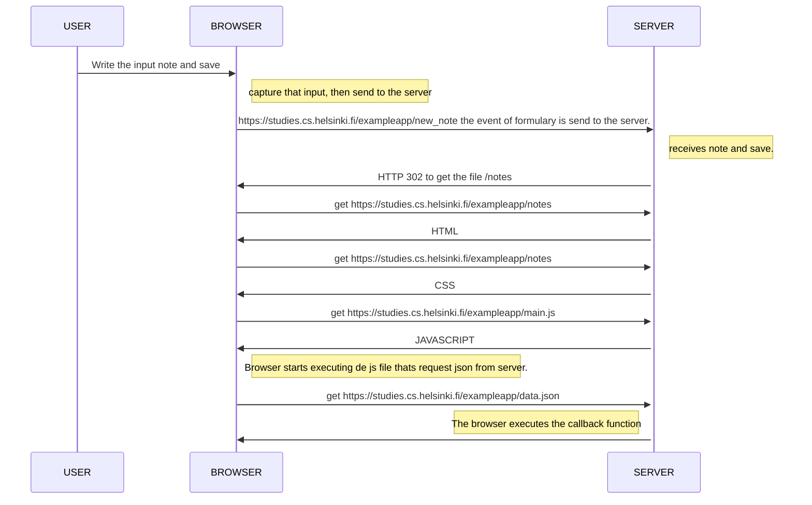

```mermaid


sequenceDiagram
    participant USER
    participant BROWSER
    participant SERVER

    USER->>BROWSER: Write the input note and save
    note right of BROWSER: capture that input, then send to the server
    
    BROWSER->>SERVER:https://studies.cs.helsinki.fi/exampleapp/new_note the event of formulary is send to the server.
    
    activate SERVER
    note right of SERVER: receives note and save.
    SERVER->>BROWSER: HTTP 302 to get the file /notes

    BROWSER->>SERVER: get    https://studies.cs.helsinki.fi/exampleapp/notes

    SERVER->>BROWSER: HTML
    
    BROWSER->>SERVER: get https://studies.cs.helsinki.fi/exampleapp/notes

    SERVER->>BROWSER: CSS

    BROWSER->>SERVER: get https://studies.cs.helsinki.fi/exampleapp/main.js

    SERVER->>BROWSER: JAVASCRIPT

    note right of BROWSER: Browser starts executing de js file thats request json from server.


    BROWSER->>SERVER: get https://studies.cs.helsinki.fi/exampleapp/data.json

    note left of SERVER: The browser executes the callback function
    SERVER->>BROWSER: 
    
    

    
```