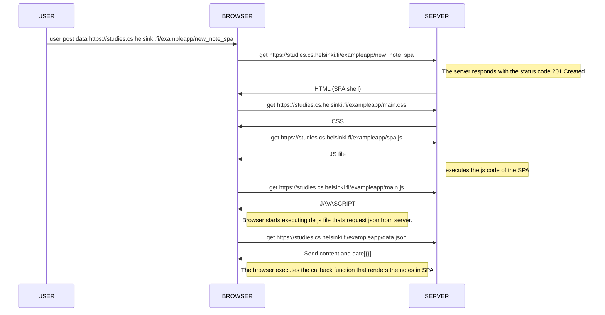

```mermaid


sequenceDiagram
    participant USER
    participant BROWSER
    participant SERVER

    USER->>BROWSER: user post data https://studies.cs.helsinki.fi/exampleapp/new_note_spa
    
    
    BROWSER->>SERVER: get https://studies.cs.helsinki.fi/exampleapp/new_note_spa
    
    
    note right of SERVER: The server responds with the status code 201 Created
    
    SERVER->>BROWSER: HTML (SPA shell)


    
    
    BROWSER->>SERVER: get    https://studies.cs.helsinki.fi/exampleapp/main.css
    

    SERVER->>BROWSER: CSS
    
    BROWSER->>SERVER: get https://studies.cs.helsinki.fi/exampleapp/spa.js

    SERVER->>BROWSER: JS file
     note right of SERVER: executes the js code of the SPA

    BROWSER->>SERVER: get https://studies.cs.helsinki.fi/exampleapp/main.js

    SERVER->>BROWSER: JAVASCRIPT

    note right of BROWSER: Browser starts executing de js file thats request json from server.


    BROWSER->>SERVER: get https://studies.cs.helsinki.fi/exampleapp/data.json

    SERVER->>BROWSER: Send content and date[{}]
    note left of SERVER: The browser executes the callback function that renders the notes in SPA
    
    
    

    
```